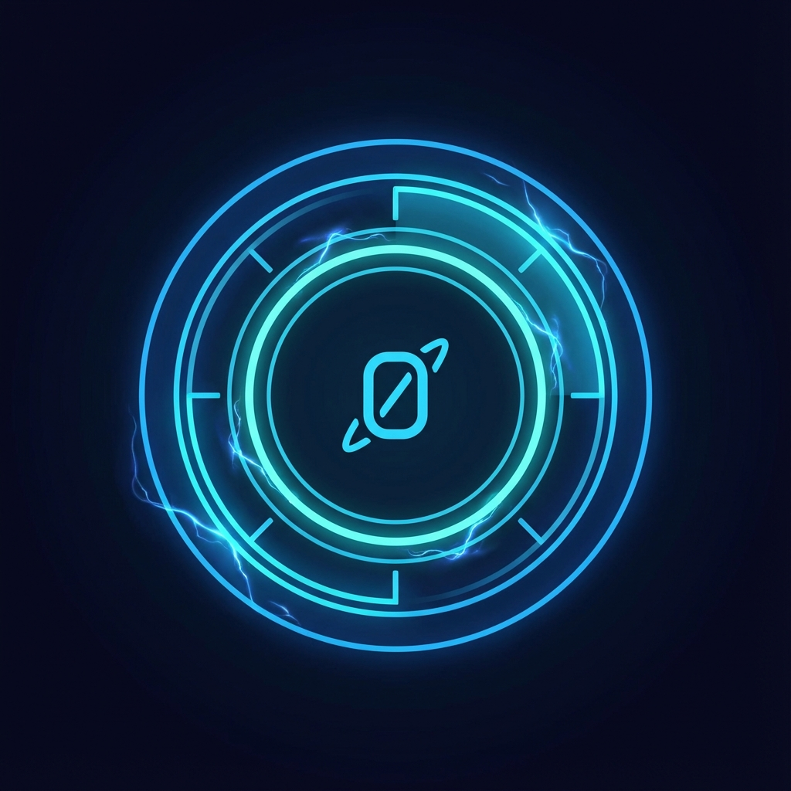
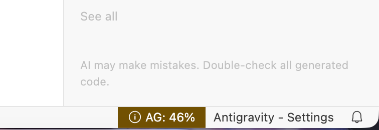
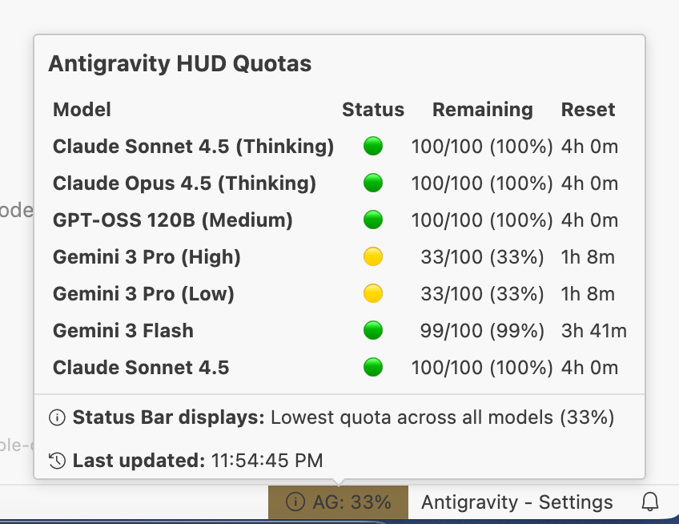

# Antigravity HUD

  

**Seamlessly monitor your Google Antigravity AI IDE model usage directly within the IDE.**

Antigravity HUD automatically detects your local Antigravity instance and displays real-time quota information in your status bar, keeping you informed without breaking your flow.

## Features

- **Zero Configuration**: Automatically hunts for Antigravity editor and Language Server processes to find your API port and token.
- **Real-Time Monitoring**: Polls the local API to keep your quota information up-to-date.
- **Unobtrusive UI**: A minimal `AG: XX%` indicator sits quietly in your status bar, changing color to warn you when quotas get low.
- **Detailed Insights**: Click the status bar item to see a breakdown of usage across all available models.

## Installation

**From VS Code:**
1. Open Extensions view (`Ctrl+Shift+X` / `Cmd+Shift+X`).
2. Search for `Antigravity HUD`.
3. Click **Install**.

**From Marketplace:**
- [Open VSX Registry](https://open-vsx.org/extension/smallyu/vscode-antigravity-hud) (Recommended for Antigravity)
- [VS Code Marketplace](https://marketplace.visualstudio.com/items?itemName=smallyu.vscode-antigravity-hud)

## Status Bar Indicators

The status bar icon provides a quick visual health check of your quota:

| Icon | Meaning | Description |
|------|---------|-------------|
| `✅ AG: 85%` | **Healthy** | Plenty of quota remaining (>50%). |
| `ℹ️ AG: 35%` | **Moderate** | Quota is being used (20-50%). |
| `⚠️ AG: 15%` | **Low** | Critical quota level (<20%). Time to be careful. |
| `🚫 AG: --` | **Disconnected** | Could not find a running Antigravity instance. |
| `🔄 AG: ...` | **Connecting** | Searching for processes or fetching initial data. |

## Configuration

You can customize the extension's behavior in VS Code Settings:

| Setting | Default | Description |
|---------|---------|-------------|
| `antigravity-hud.pollingInterval` | `60` | How often to fetch quota data (in seconds). |
| `antigravity-hud.processPatterns` | `["antigravity", "gemini-ls", "gemini-code"]` | Process names to scan for API credentials. |

## How It Works

Antigravity HUD works like a companion utility:
1. **Process Hunting**: It scans your system for running Antigravity-related processes.
2. **Credential Extraction**: It securely extracts the `--api-port` and `--auth-token` arguments from the running process.
3. **API Polling**: It uses these credentials to query the local `http://127.0.0.1:{port}/api/v1/quota` endpoint.
4. **Visual Feedback**: It aggregates the lowest quota percentage and updates the status bar.

## Commands

- **Antigravity HUD: Show Quota**: Open the detailed quota information popup.
- **Antigravity HUD: Refresh**: Force a re-scan of processes and refresh quota data.

## License

MIT
