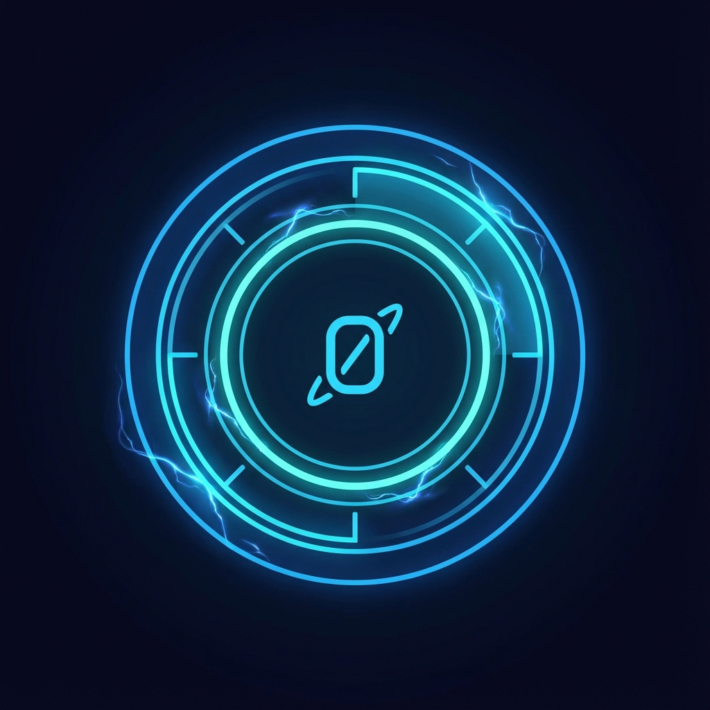
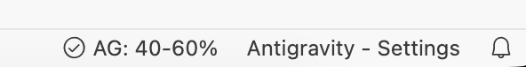
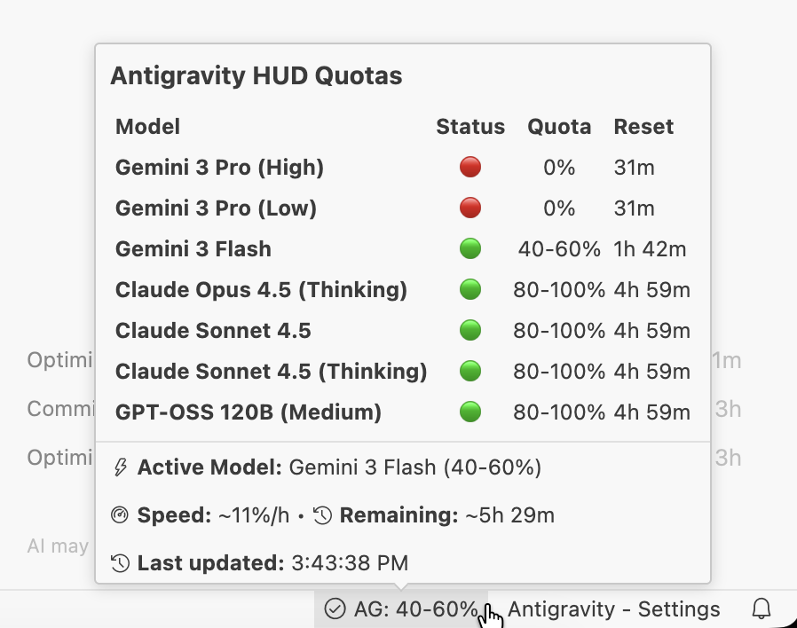

# Antigravity HUD

  

**Seamlessly monitor your Google Antigravity AI IDE model usage directly within the IDE.**

Antigravity HUD automatically detects your local Antigravity instance and displays real-time quota information in your status bar, keeping you informed without breaking your flow.

## ✨ Features

- 🎯 **Zero Configuration**: Automatically hunts for Antigravity editor and Language Server processes to find your API port and token.
- ⚡ **Auto-Detection**: Intelligently detects and displays the model you are currently using.
- 📉 **Usage Statistics**: Tracks consumption speed (% per hour) and estimates remaining time for each model.
- 📊 **Real-Time Monitoring**: Polls the local API to keep your quota information up-to-date.
- 💎 **Unobtrusive UI**: A minimal `AG: XX%` indicator sits in your status bar, with a rich hover tooltip.
- 🔍 **Detailed Insights**: View comprehensive statistics, including total usage time and estimated full cycle time.
- 🔔 **Smart Notifications**: Optional alerts when you're running low on quota.

## Usage Statistics & Insights

Antigravity HUD now does more than just show numbers. It analyzes your usage patterns to provide:

- **Consumption Speed**: See how fast you're using each model's quota (e.g., `~120%/h`).
- **Estimated Time Remaining**: Know exactly how many minutes or hours of usage you have left at your current pace.
- **Active Model Tracking**: The status bar automatically switches to show the model generating activity.
- **Usage History**: Tracks total time spent using each model across sessions.

### Quota Display Characteristics

> [!NOTE]
> In recent versions of the Antigravity editor, model usage quota is reported in 20% increments (buckets).
> The status bar may display these models as ranges (e.g., `80-100%`, `60-80%`) when exact counts are not available.
> The hover tooltip can also show a 5-bar "battery" indicator for an at-a-glance view.

To view detailed statistics, click the status bar item and select a specific model from the list.

## Installation

**From VS Code:**
1. Open Extensions view (`Ctrl+Shift+X` / `Cmd+Shift+X`).
2. Search for `Antigravity HUD`.
3. Click **Install**.

**From Marketplace:**
- [Open VSX Registry](https://open-vsx.org/extension/smallyu/vscode-antigravity-hud) (Recommended for Antigravity)
- [VS Code Marketplace](https://marketplace.visualstudio.com/items?itemName=smallyu.vscode-antigravity-hud)

## Status Bar Indicators

The status bar icon provides a quick visual health check of your quota:

| Icon | Meaning | Description |
|------|---------|-------------|
| `🟢 AG: 85%` | **Healthy** | Plenty of quota remaining (>50%). |
| `🟡 AG: 35%` | **Moderate** | Quota is being used (20-50%). |
| `🔴 AG: 15%` | **Low** | Critical quota level (<20%). |
| `🚫 AG: --` | **Disconnected** | Could not find a running Antigravity instance. |
| `🔄 AG: ...` | **Connecting** | Searching for processes or fetching initial data. |

## Configuration

You can customize the extension's behavior in VS Code Settings:

| Setting | Default | Description |
|---------|---------|-------------|
| `antigravity-hud.pollingInterval` | `60` | How often to fetch quota data (in seconds). |
| `antigravity-hud.processPatterns` | `["antigravity", "gemini-ls", "gemini-code"]` | Process names to scan for API credentials. |
| `antigravity-hud.lowQuotaThreshold` | `20` | Threshold percentage for low quota warnings. |
| `antigravity-hud.enableNotifications` | `false` | Enable or disable low quota desktop notifications. |
| `antigravity-hud.tooltipStatusStyle` | `battery` | Status column style in hover tooltip (`battery` or `traffic`). |
| `antigravity-hud.logQuotaUpdates` | `false` | Log detailed quota updates to the output channel (noisy). |

## How It Works

Antigravity HUD works like a companion utility:
1. **Process Hunting**: It scans your system for running Antigravity-related processes.
2. **Credential Extraction**: It securely extracts the `--api-port` and `--auth-token` arguments from the running process.
3. **API Polling**: It uses these credentials to query the local API and parse the response.
4. **Calculations**: It processes updates to calculate consumption speed, usage time, and auto-detect activity.
5. **Visual Feedback**: It displays the active or lowest model's quota in the status bar and provides detailed insights via hover and click.

## Commands

- **Antigravity HUD: Show Quota**: Open the detailed quota information popup.
- **Antigravity HUD: Refresh**: Force a re-scan of processes and refresh quota data.

## 🤝 Contributing

Contributions are welcome! Whether it's reporting a bug, suggesting a feature, or submitting a pull request, your help is appreciated.

1. Fork the repository.
2. Create your feature branch (`git checkout -b feature/AmazingFeature`).
3. Commit your changes (`git commit -m 'Add some AmazingFeature'`).
4. Push to the branch (`git push origin feature/AmazingFeature`).
5. Open a Pull Request.

## 🆘 Support & Feedback

If you encounter any issues or have questions, please feel free to:
- Open an [issue](https://github.com/smallyunet/vscode-antigravity-hud/issues) on GitHub.
- Reach out via the [VS Code Marketplace](https://marketplace.visualstudio.com/items?itemName=smallyu.vscode-antigravity-hud) reviews.

## 👤 Author

**smallyu**
- GitHub: [@smallyunet](https://github.com/smallyunet)

## 📄 License

This project is licensed under the MIT License - see the [LICENSE](LICENSE) file for details.
